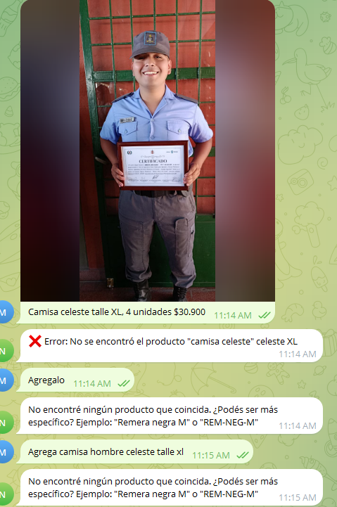

POST http://do/set-pending-photo - Ok @ 1/11/2026, 11:13:13 AM
GET http://do/get-history - Ok @ 1/11/2026, 11:14:26 AM
POST http://do/add-message - Ok @ 1/11/2026, 11:14:26 AM
POST http://do/add-message - Ok @ 1/11/2026, 11:14:29 AM
POST https://nexo-bot.mauro25qe.workers.dev/webhook - Ok @ 1/11/2026, 11:14:25 AM
  (log) [2026-01-11T14:14:25.939Z] User 7856132212 (M25): Camisa celeste talle XL, 4 unidades $30.900
  (log) === AI RESPONSE ===
  (log) Has tool_calls: true
  (log) Response text:
  (log) Full response: {"response":null,"tool_calls":[{"name":"stock_add","arguments":{"producto":"camisa celeste","cantidad":"4","color":"celeste","talle":"XL","precio":"30900"}}],"usage":{"prompt_tokens":2374,"completion_tokens":47,"total_tokens":2421}}
  (log) Ejecutando tool: stock_add {
  producto: 'camisa celeste',
  cantidad: '4',
  color: 'celeste',
  talle: 'XL',
  precio: '30900'
}
  (log) === DEBUG PRODUCTOS ===
  (log) Total filas: 5
  (log) Headers: []
  (log) Primera fila de datos: ["ID","SKU","Nombre","Categoria","Color","Talle","Descripcion","Temporada","Proveedor","Foto URL","Stock","Stock Mínimo","Precio"]   
  (log) Headers encontrados en fila: 1 [
  'ID',          'SKU',
  'Nombre',      'Categoria',
  'Color',       'Talle',
  'Descripcion', 'Temporada',
  'Proveedor',   'Foto URL',
  'Stock',       'Stock Mínimo',
  'Precio'
]
  (log) Productos parseados: 3
  (log) Primer producto: {"ID":"PMK9O51I3IGM5N","SKU":"REM-NEG-M","Nombre":"remera negra hombre","Categoria":"Remera","Color":"negro","Talle":"M","Descripcion":"","Temporada":"","Proveedor":"","Foto URL":"AgACAgEAAxkBAANmaWNzuOPcl7SmzJFXJPsfrrAE19cAAukLaxvQCSBHM0v7840YhM4BAAMCAAN5AAM4BA","Stock":"27","Stock Mínimo":"5","Precio":"29000"}
  (error) Error ejecutando tool stock_add: Error: No se encontró el producto "camisa celeste" celeste XL
  (log) Tool result: ❌ Error: No se encontró el producto "camisa celeste" celeste XL
GET http://do/get-pending-photo - Ok @ 1/11/2026, 11:14:29 AM
POST https://nexo-bot.mauro25qe.workers.dev/webhook - Ok @ 1/11/2026, 11:14:40 AM
  (log) [2026-01-11T14:14:40.312Z] User 7856132212 (M25): Agregalo
  (log) === DEBUG PRODUCTOS ===
  (log) Total filas: 5
  (log) Headers: []
  (log) Primera fila de datos: ["ID","SKU","Nombre","Categoria","Color","Talle","Descripcion","Temporada","Proveedor","Foto URL","Stock","Stock Mínimo","Precio"]   
  (log) Headers encontrados en fila: 1 [
  'ID',          'SKU',
  'Nombre',      'Categoria',
  'Color',       'Talle',
  'Descripcion', 'Temporada',
  'Proveedor',   'Foto URL',
  'Stock',       'Stock Mínimo',
  'Precio'
]
  (log) Productos parseados: 3
  (log) Primer producto: {"ID":"PMK9O51I3IGM5N","SKU":"REM-NEG-M","Nombre":"remera negra hombre","Categoria":"Remera","Color":"negro","Talle":"M","Descripcion":"","Temporada":"","Proveedor":"","Foto URL":"AgACAgEAAxkBAANmaWNzuOPcl7SmzJFXJPsfrrAE19cAAukLaxvQCSBHM0v7840YhM4BAAMCAAN5AAM4BA","Stock":"27","Stock Mínimo":"5","Precio":"29000"}
GET http://do/get-pending-photo - Ok @ 1/11/2026, 11:14:40 AM
POST https://nexo-bot.mauro25qe.workers.dev/webhook - Ok @ 1/11/2026, 11:15:09 AM
  (log) [2026-01-11T14:15:09.175Z] User 7856132212 (M25): Agrega camisa hombre celeste talle xl
  (log) === DEBUG PRODUCTOS ===
  (log) Total filas: 5
  (log) Headers: []
  (log) Primera fila de datos: ["ID","SKU","Nombre","Categoria","Color","Talle","Descripcion","Temporada","Proveedor","Foto URL","Stock","Stock Mínimo","Precio"]   
  (log) Headers encontrados en fila: 1 [
  'ID',          'SKU',
  'Nombre',      'Categoria',
  'Color',       'Talle',
  'Descripcion', 'Temporada',
  'Proveedor',   'Foto URL',
  'Stock',       'Stock Mínimo',
  'Precio'
]
  (log) Productos parseados: 3
  (log) Primer producto: {"ID":"PMK9O51I3IGM5N","SKU":"REM-NEG-M","Nombre":"remera negra hombre","Categoria":"Remera","Color":"negro","Talle":"M","Descripcion":"","Temporada":"","Proveedor":"","Foto URL":"AgACAgEAAxkBAANmaWNzuOPcl7SmzJFXJPsfrrAE19cAAukLaxvQCSBHM0v7840YhM4BAAMCAAN5AAM4BA","Stock":"27","Stock Mínimo":"5","Precio":"29000"}
GET https://nexo-bot.mauro25qe.workers.dev/health - Ok @ 1/11/2026, 11:15:22 AM
GET https://nexo-bot.mauro25qe.workers.dev/ - Ok @ 1/11/2026, 11:15:37 AM
GET https://nexo-bot.mauro25qe.workers.dev/setup-webhook - Ok @ 1/11/2026, 11:15:43 AM

  'Precio'
]
  (log) Productos parseados: 3
  (log) Primer producto: {"ID":"PMK9O51I3IGM5N","SKU":"REM-NEG-M","Nombre":"remera negra hombre","Categoria":"Remera","Color":"negro","Talle":"M","Descripcion":"","Temporada":"","Proveedor":"","Foto URL":"AgACAgEAAxkBAANmaWNzuOPcl7SmzJFXJPsfrrAE19cAAukLaxvQCSBHM0v7840YhM4BAAMCAAN5AAM4BA","Stock":"27","Stock Mínimo":"5","Precio":"29000"}
GET http://do/get-pending-photo - Ok @ 1/11/2026, 11:16:40 AM
POST https://nexo-bot.mauro25qe.workers.dev/webhook - Ok @ 1/11/2026, 11:16:53 AM
  (log) [2026-01-11T14:16:53.770Z] User 7856132212 (M25): vendi a mauro venticinque dos remera negra M
  (log) === DEBUG PRODUCTOS ===
  (log) Total filas: 5
  (log) Headers: []
  (log) Primera fila de datos: ["ID","SKU","Nombre","Categoria","Color","Talle","Descripcion","Temporada","Proveedor","Foto URL","Stock","Stock Mínimo","Precio"]   
  (log) Headers encontrados en fila: 1 [
  'ID',          'SKU',
  'Nombre',      'Categoria',
  'Color',       'Talle',
  'Descripcion', 'Temporada',
  'Proveedor',   'Foto URL',
  'Stock',       'Stock Mínimo',
  'Precio'
]
  (log) Productos parseados: 3
  (log) Primer producto: {"ID":"PMK9O51I3IGM5N","SKU":"REM-NEG-M","Nombre":"remera negra hombre","Categoria":"Remera","Color":"negro","Talle":"M","Descripcion":"","Temporada":"","Proveedor":"","Foto URL":"AgACAgEAAxkBAANmaWNzuOPcl7SmzJFXJPsfrrAE19cAAukLaxvQCSBHM0v7840YhM4BAAMCAAN5AAM4BA","Stock":"27","Stock Mínimo":"5","Precio":"29000"}